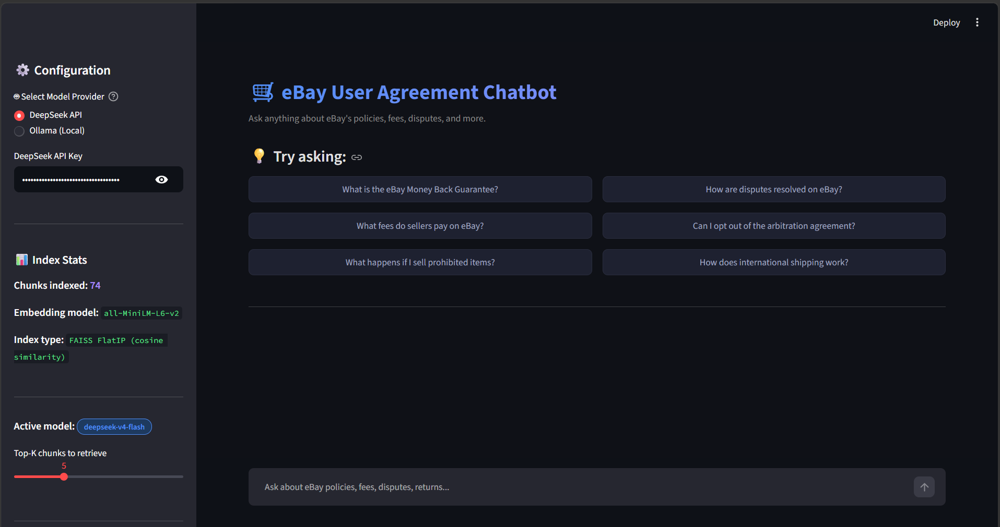
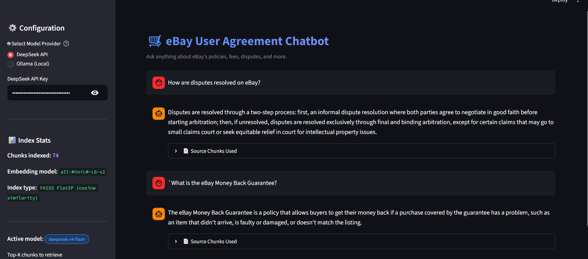

# 🛒 eBay User Agreement RAG Chatbot

An AI-powered chatbot that answers questions about the **eBay User Agreement** using a full **Retrieval-Augmented Generation (RAG)** pipeline with real-time streaming responses.

> Built as part of the **Amlgo Labs Junior AI Engineer Assignment**  
> **Author:** Jayant Bisht | **Stack:** FAISS · Sentence Transformers · DeepSeek API · Ollama · Streamlit

---

## 🎥 Demo

> 📹 **Live App:** [https://ebayua.streamlit.app](https://ebayua.streamlit.app)  
> _[Insert GIF or video link here after recording]_

---

## 🏗️ Project Architecture & Flow

```
┌─────────────────────────────────────────────────────────────────┐
│                        USER (Streamlit UI)                       │
│              Types a question in the chat input                  │
└───────────────────────────┬─────────────────────────────────────┘
                            │
                            ▼
┌─────────────────────────────────────────────────────────────────┐
│                     app.py  (Streamlit)                          │
│  • Chat interface with real-time streaming token display         │
│  • Sidebar: model switcher, index stats, top-k slider           │
│  • Suggestion buttons, source chunk viewer, clear chat          │
└───────────────────────────┬─────────────────────────────────────┘
                            │
                            ▼
┌─────────────────────────────────────────────────────────────────┐
│                   src/pipeline.py                                │
│  • Orchestrates retriever + generator                            │
│  • Returns (sources, token_generator) tuple to app.py           │
└──────────────┬────────────────────────────┬─────────────────────┘
               │                            │
               ▼                            ▼
┌──────────────────────────┐  ┌─────────────────────────────────┐
│    src/retriever.py       │  │       src/generator.py           │
│                           │  │                                  │
│  1. Embed query with      │  │  1. Build prompt with chunks     │
│     all-MiniLM-L6-v2     │  │  2. Call DeepSeek API or Ollama  │
│  2. FAISS cosine search  │  │  3. Stream tokens to Streamlit   │
│  3. Return top-k chunks  │  │                                  │
└──────────────────────────┘  └─────────────────────────────────┘
               │
               ▼
┌─────────────────────────────────────────────────────────────────┐
│         vectordb/index.faiss  +  chunks/chunks.json              │
│              Built once by running preprocess.py                 │
└─────────────────────────────────────────────────────────────────┘
```

### End-to-End Flow

1. User types a query in the Streamlit chat input
2. `retriever.py` embeds the query using `all-MiniLM-L6-v2`
3. FAISS performs cosine similarity search → returns top-k chunks
4. Retrieved chunks + query are injected into the prompt template
5. `generator.py` calls DeepSeek API or Ollama with `stream=True`
6. Streamlit renders each token in real time with a blinking cursor `▌`
7. Source chunks used are shown in an expander below the response

### Components

| Module | File | Responsibility |
|---|---|---|
| Preprocessing | `preprocess.py` | PDF extraction, chunking, FAISS indexing |
| Retriever | `src/retriever.py` | Semantic search over vector DB |
| Generator | `src/generator.py` | LLM streaming (DeepSeek / Ollama) |
| Pipeline | `src/pipeline.py` | Combines retriever + generator |
| UI | `app.py` | Streamlit chatbot interface |

---

## 📁 Folder Structure

```
ebay_rag/
├── data/
│   └── AI_Training_Document.pdf     # eBay User Agreement source
├── chunks/
│   └── chunks.json                  # Processed text segments (auto-generated)
├── vectordb/
│   └── index.faiss                  # FAISS vector index (auto-generated)
├── notebooks/
│   └── exploration.ipynb            # Preprocessing & evaluation notebook
├── src/
│   ├── __init__.py
│   ├── retriever.py                 # FAISS retrieval logic
│   ├── generator.py                 # LLM streaming (DeepSeek + Ollama)
│   └── pipeline.py                  # RAG orchestration
├── assets/                          # Screenshots for README
├── app.py                           # Streamlit chatbot UI
├── preprocess.py                    # Run once to build index
├── requirements.txt
├── .env.example
└── README.md
```

---

## ⚙️ Setup & Installation

### 1. Clone the repository
```bash
git clone https://github.com/jayant1554/ebay_rag.git
cd ebay_rag
```

### 2. Create a Python virtual environment
```bash
# Windows (CMD)
python -m venv venv
venv\Scripts\activate

# Windows (PowerShell)
python -m venv venv
.\venv\Scripts\Activate.ps1

# macOS/Linux
python -m venv venv
source venv/bin/activate
```

### 3. Install dependencies
```bash
pip install -r requirements.txt
```

### 4. Set up environment variables

Create a `.env` file in the root of the project:

```bash
# Windows (CMD)
echo DEEPSEEK_API_KEY=your_deepseek_api_key_here > .env

# Windows (PowerShell)
New-Item .env -ItemType File
Add-Content .env "DEEPSEEK_API_KEY=your_deepseek_api_key_here"

# macOS/Linux
echo "DEEPSEEK_API_KEY=your_deepseek_api_key_here" > .env
```

> 💡 The `.env` file is in `.gitignore` and will never be pushed to GitHub.  
> 💡 Get a free API key at: https://platform.deepseek.com  
> 💡 If using Ollama only, you can skip this step entirely.

### 5. Add the document
Place `AI_Training_Document.pdf` inside the `/data` folder:
```
data/
└── AI_Training_Document.pdf
```

### 6. Run preprocessing — creates embeddings and builds RAG pipeline (ONE TIME ONLY)
```bash
python preprocess.py
```

This script:
- Extracts and cleans text from the PDF
- Splits into sentence-aware chunks (~200 words, 30-word overlap)
- Generates embeddings using `all-MiniLM-L6-v2`
- Saves FAISS index to `vectordb/index.faiss`
- Saves chunks to `chunks/chunks.json`

Expected output:
```
📄 Extracting text from PDF...
🧹 Cleaning text...
✂️  Chunking text... Created 74 chunks
🔢 Generating embeddings with all-MiniLM-L6-v2...
📦 Building FAISS index... 74 vectors of dimension 384
✅ Preprocessing complete!
```

> ⚠️ Re-run only if the source document changes.

### 7. (Optional) Set up Ollama for local inference
```bash
# Install Ollama from https://ollama.com
ollama pull mistral
ollama pull llama3

# Start Ollama before launching the app
ollama serve
```

---

## ▶️ Running the Chatbot with Streaming

```bash
streamlit run app.py
```

Open your browser at: **http://localhost:8501**

### Streamlit App Features

| Feature | Location |
|---|---|
| Natural language query input | Bottom chat bar |
| Real-time streaming response | Chat window (token-by-token with `▌` cursor) |
| Source chunks display | Expander below each response |
| Current model in use | Sidebar — Active model badge |
| Number of indexed chunks | Sidebar — Index Stats section |
| Switch between DeepSeek / Ollama | Sidebar — Model Provider radio buttons |
| Adjust top-k retrieval | Sidebar — Top-K slider (3–10) |
| Clear chat history | Sidebar — 🗑️ Clear Chat button |
| Toggle source visibility | Sidebar — Show source chunks toggle |

> 💡 Select **DeepSeek API** for cloud use. Select **Ollama (Local)** for fully offline inference.

---

## 🤖 Model & Embedding Choices

### Embedding Model: `all-MiniLM-L6-v2`

| Property | Detail |
|---|---|
| Parameters | 22M — lightweight and fast |
| Output | 384-dimensional L2-normalised vectors |
| Speed | ~0.8ms per chunk on CPU |
| Why chosen | No API cost, runs locally, strong semantic similarity for legal text |

### Vector Database: FAISS `IndexFlatIP`

| Property | Detail |
|---|---|
| Search type | Exact cosine similarity (Inner Product on normalised vectors) |
| Search time | < 1ms for top-5 retrieval over 74 vectors |
| Persistence | Saved/loaded from `vectordb/index.faiss` |
| Why chosen | No external service needed, fully local, fast and deterministic |

### LLM Options (switchable in sidebar)

| Provider | Model | Type | Notes |
|---|---|---|---|
| **DeepSeek API** | `deepseek-v4-flash` | Cloud | Fast, accurate, free tier available |
| **Ollama** | `mistral` | Local | No internet required |
| **Ollama** | `llama3` | Local | Larger context window |
| **Ollama** | `qwen2.5:7b` | Local | Good multilingual support |

---

## 💬 Sample Queries & Responses

The following queries were tested against the eBay User Agreement. Success cases demonstrate accurate grounded retrieval; failure cases expose model and retrieval limitations.

---

### ✅ Query 1 — SUCCESS

**Q: How are disputes resolved on eBay?**

> Disputes between you and eBay are resolved exclusively through final and binding arbitration, rather than in court. Exceptions allow you or eBay to seek relief in small claims court (if claims qualify) or seek equitable relief in court for intellectual property infringement. Before arbitration, both parties must participate in good‑faith informal dispute resolution by sending a valid Notice of Dispute.

**Result:** Section 19 retrieved correctly. Response is fully grounded — no external knowledge added.

---

### ✅ Query 2 — SUCCESS

**Q: What is the eBay Money Back Guarantee?**

> The eBay Money Back Guarantee is a policy that allows buyers to get their money back if there's a problem with a purchase, such as when an item doesn't arrive, is faulty or damaged, or doesn't match the listing. If a seller chooses to reimburse a buyer or is required to do so under this guarantee, eBay may invoice the seller for the reimbursement amount. The seller may also be subject to collection mechanisms if they cannot pay the reimbursement. This guarantee can be suspended by eBay if there's suspected abuse or interference with its proper working.

**Result:** Section 14 retrieved correctly. Concise and accurate answer with no hallucination.

---

### ✅ Query 3 — SUCCESS

**Q: Can I opt out of the arbitration agreement?**

> Yes, you can opt out of the arbitration agreement by mailing an Opt-Out Notice to eBay Inc., Attn: Litigation Department, RE: Opt-Out Notice, 583 West eBay Way, Draper, UT 84020. The Opt-Out Notice must be postmarked no later than the effective date of the amendment or 30 days from the date you first accept this User Agreement. You must complete, sign, and mail the Opt-Out Notice to opt out of this Agreement to Arbitrate.

**Result:** Section 19.B.9 retrieved with exact address, deadline, and procedure — high precision retrieval.

---

### ❌ Query 4 — FAILURE

**Q: What is eBay's stock price?**

> I couldn't find specific information about eBay's stock price in the provided context. For current stock prices, please refer to a financial news source or a stock market tracking service.

**Result:** Correct refusal — financial market data is not present in the eBay User Agreement document. No hallucination occurred. The system prompt constraint worked as intended.

---

### ⚠️ Query 5 — PARTIAL / LIMITATION

**Q: How can I sell a gun or firearm on eBay?**

> I couldn't find specific information about selling guns or firearms on eBay in the provided User Agreement. However, eBay has certain policies and restrictions regarding the sale of items subject to regulations or laws. For accurate information, visit eBay's official website or contact customer service.

**Result:** Partial answer — the User Agreement references eBay's Listing Policies page for prohibited items, but that external page is not included in the RAG corpus. The model correctly admitted the limitation rather than hallucinating a definitive answer.

---

### Query Results Summary

| # | Query | Result | Notes |
|---|---|---|---|
| 1 | How are disputes resolved on eBay? | ✅ Success | Section 19 |
| 2 | What is the eBay Money Back Guarantee? | ✅ Success | Section 14 |
| 3 | Can I opt out of the arbitration agreement? | ✅ Success | Section 19.B.9 |
| 4 | What is eBay's stock price? | ❌ Correct refusal | Not in the document |
| 5 | How can I sell a gun or firearm? | ⚠️ Partial | External ref limitation |

### App Screenshots

| Suggested Questions | Live Response |
|---|---|
|  |  |

---

## 📄 License

This project was built as a technical assignment for Amlgo Labs.  
All code, prompts, and documentation are original work by **Jayant Bisht**.